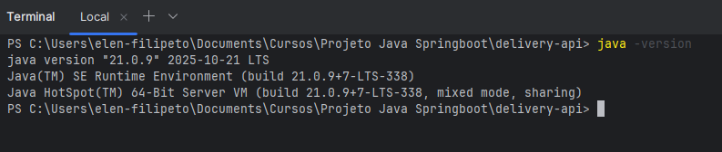
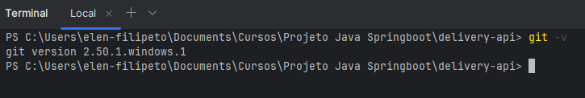
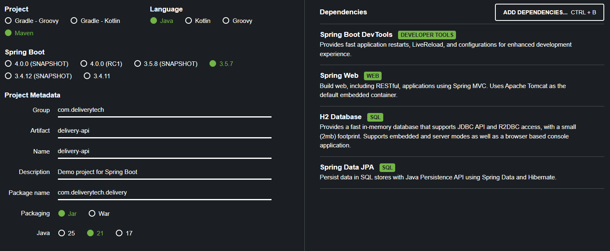
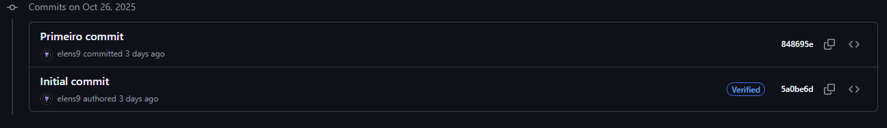

# delivery-api
Curso de extensão de API REST Full com Java Springboot

# Delivery Tech API

Sistema de delivery desenvolvido com Spring Boot e Java 21.

## 🚀 Tecnologias
- **Java 21 LTS** (versão mais recente)
- Spring Boot 3.5.7
- Spring Web
- Spring Data JPA
- H2 Database
- Maven

## ⚡ Recursos Modernos Utilizados
- Records (Java 14+)
- Text Blocks (Java 15+)
- Pattern Matching (Java 17+)
- Virtual Threads (Java 21)

## 🏃‍♂️ Como executar
1. **Pré-requisitos:** JDK 21 instalado
2. Clone o repositório
3. Execute: `./mvnw spring-boot:run`
4. Acesse: http://localhost:8080/health

## 📋 Endpoints
- GET /health - Status da aplicação (inclui versão Java)
- GET /info - Informações da aplicação
- GET /h2-console - Console do banco H2

## 🔧 Configuração
- Porta: 8080
- Banco: H2 em memória
- Profile: development

## 👨‍💻 Desenvolvedor
Elen Sant'Anna Filipeto - Arquitetura de Sistemas API REST Full com Java Springboot 

Desenvolvido com JDK 21 e Spring Boot 3.5.7

## Entregáveis Roteiro 1
- Screenshot do terminal mostrando java -version
    

- Screenshot do git --version funcionando
    

- Screenshot da configuração do projeto no Spring Initializr
    

- URL repositório público no GitHub:
  https://github.com/elens9/delivery-api-elen

- Screenshot commit inicial
  

    

